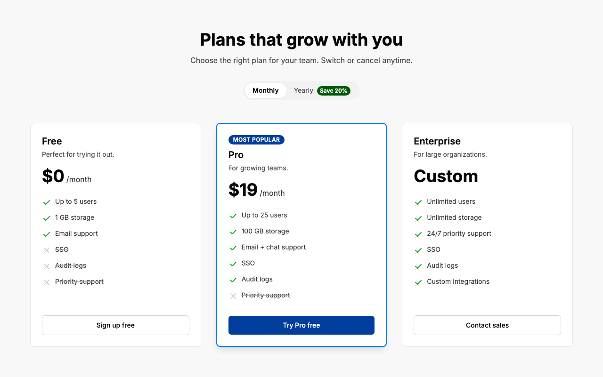
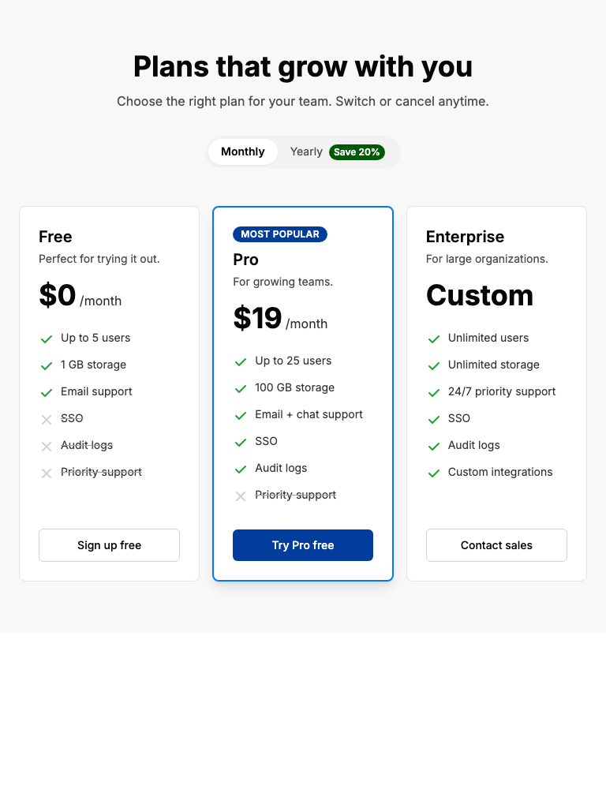
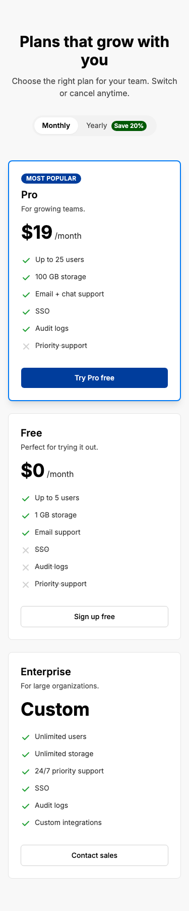

# Pricing Section

## Visual Requirements

Build a marketing pricing section that displays three plan tiers — **Free**, **Pro**, and **Enterprise** — with a billing cycle toggle and feature comparison.

The section consists of:

- A centered heading "Plans that grow with you" and a one-line subheading.
- A **Monthly / Yearly** toggle below the heading. Yearly carries a small "Save 20%" badge.
- Three pricing cards. Side-by-side at desktop / tablet, stacked vertically at mobile widths. The **Pro** card is visually emphasized (heavier border, shadow, "Most popular" badge) and appears **first** when the cards stack on mobile.
- Each card contains, in order: tier name, short description, large price + period, feature list, CTA button at the bottom.
- Feature list rows use a check icon for included features and a cross icon for excluded ones. Excluded items are visually muted (line-through and/or lower contrast).
- The **Pro** CTA is a solid primary-color button. The **Free** and **Enterprise** CTAs are outlined.

Use existing design tokens from `src/styles/tokens.css` for color, typography, spacing, and radius — no hardcoded hex values, no arbitrary Tailwind values, no inline `style` attributes.

The reference images below show the exact layout, proportions, and treatment at each viewport. Match them.

## Reference

### Desktop (1280)

### Tablet (768)

### Mobile (375)

